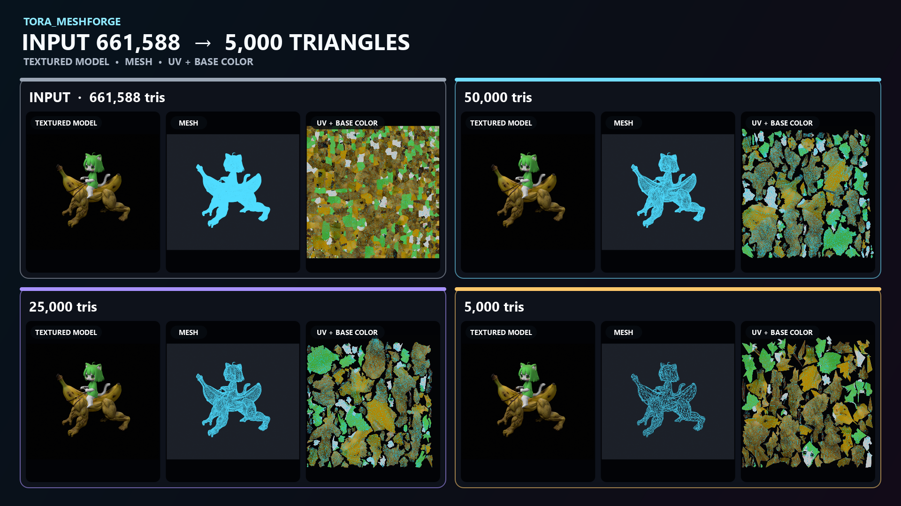

# Tora_MeshForge

[日本語](README.md) | [English](README.en.md) | [GitHub](https://github.com/tlano-z/Tora_MeshForge) | [不具合報告](https://github.com/tlano-z/Tora_MeshForge/issues)

Tora_MeshForgeは、密なモデルやAI生成の静的3Dモデルを、扱いやすい三角形数とUVを持つFBXへ変換するWindows向けツールです。複数候補の比較と、三角形数を指定した単一モデルの生成に対応します。

仕組み、手作業との違い、適した用途については[このツールについて](docs/about.md)を参照してください。



## できること

- 複数の三角形数を試し、品質重視・バランス・軽量の3候補を比較
- 指定した三角形数で1つのFBXを生成
- UVをまとまりのある島へ再構成
- 元モデルからBase Colorを再構成し、失われた形状差をNormalマップとして生成
- 元モデルと結果のGeometry / Mesh / Texture / UVプレビューを作成
- 形状、UV、テクスチャ、マテリアル、FBX再読込を自動確認
- 所要時間、進捗、ログ、キャンセル、結果ファイルへのリンクをGUIに表示

## 対象モデル

- 入力形式: FBX、GLB/glTF、OBJ
- 対象: 静的モデル
- rig、animation、shape keyは検出できますが、変換後のモデルへは引き継ぎません。
- 再構成するマテリアルはBase Colorと新規生成するShape Normalです。元モデルのRoughness、Metallic、Emission、Alpha、既存Normalの転送・合成には対応していません。

## 必要環境

- Windows 10または11
- Python 3.11以上
- Blender 4.2 LTS以上
- 初回インストール時のインターネット接続

Blenderは[公式サイト](https://www.blender.org/download/)から入手できます。一般的なインストール場所は自動検出されます。

## インストールと起動

1. GitHubから取得したZIPを、継続して使用するフォルダへ展開します。
2. `Install-Tora_MeshForge.bat`をダブルクリックします。
3. 最後に`READY`と表示されたことを確認します。
4. `Tora_MeshForge.bat`をダブルクリックします。

インストールできない場合は[インストールガイド](docs/installation.md)を参照してください。

## 基本的な使い方

### 1. 入力と出力を指定する

- `Input model`: 元モデル
- `Texture override (optional)`: モデルから参照できない元テクスチャが1枚だけある場合に指定
- `Output FBX`: 単一生成の保存先、またはQuality Sweepの出力フォルダ名の基準

通常はこの3項目だけ指定します。Blenderや作業フォルダを変更する場合だけ`Show advanced paths`を開きます。元モデルの詳細な検査値を見る場合は`Show inspection findings`を開きます。

### 2. ワークフローを実行する

| やりたいこと | 設定 | 実行ボタン |
|---|---|---|
| 適切な三角形数が分からない、複数候補を比較したい | `Quality Sweep`の候補リスト | `Run Quality Sweep` |
| 必要な三角形数が決まっている | `Single Target Build`のpresetとtarget | `Run Single Target Build` |

初めて処理するモデルにはQuality Sweepを推奨します。標準候補は50,000 / 25,000 / 10,000 / 5,000三角形です。

`Shared output settings`のShape Normal、texture resolution、UV marginは両方のワークフローへ適用されます。Quality SweepはSingle Targetの値を使用せず、Single Target BuildはSweep候補を使用しません。

### 3. 完了まで待つ

`Workflow monitor`に、現在の段階、進捗、概算所要時間、経過時間、残り目安が表示されます。UV探索はモデルによって数分以上かかります。必要な場合は`Cancel`で中止できます。

完了すると`Results`に結果確認HTML、モデル名、保存フォルダが表示されます。HTMLまたはフォルダのリンクをクリックして結果を開けます。

## 結果の確認

Quality Sweepでは`final-evaluation.html`を開き、SOURCEと次の候補を比較します。

- `Fidelity`: 元モデルに最も近い候補
- `Balanced`: 品質と三角形数のバランスを取った候補
- `Lightweight`: 正常に生成できた中で最も軽い候補

Single Target Buildでは、出力FBXと同じ場所に作成される`*.evaluation.html`を開き、SOURCEと生成結果を比較します。

- Geometry / Mesh / Textureプレビュー
- UV-onlyとUV-over-Base-Color
- Shape Normalと投影できなかった箇所のマスク
- 自動チェックの結果

自動チェックがPASSでも、輪郭、細い部位、接触部、テクスチャ、UVの編集しやすさは目視で確認してください。

## 必要な場合だけ使う機能

個別工程の結果を調べる場合は`Show manual operations`を開きます。通常の変換では使用しません。

| ボタン | 用途 |
|---|---|
| Inspect | モデルを変更せず、構造と三角形数を確認 |
| Static FBX Round Trip | 形状を変えず、FBXの再出力と再読込を確認 |
| Fast Optimize | 既存UVとマテリアルを維持した簡易的な削減 |
| Runtime Rebuild | 元表面からの移動を小さく抑えてUVとBase Colorを再構成 |
| Surface Retopology | 指定した三角形数で1つのモデルを生成 |
| Triangle Sweep | 複数の三角形数を生成して比較 |

## 主な出力ファイル

単一生成では、出力FBXの隣にBase Color、Shape Normal、UV画像、3方向・4表示のSOURCE／生成結果プレビュー、処理レポート、`*.evaluation.html`が作成されます。

Quality Sweepでは、候補ごとのFBXと画像に加えて、SOURCEプレビュー、SOURCE UV-over-Base-Color、候補の比較結果、`final-evaluation.html`が作成されます。

## CLI

単一モデルを生成:

```powershell
.\.venv\Scripts\tora-meshforge.exe process `
  --mode surface-retopology `
  --input "C:\models\source.fbx" `
  --texture "C:\models\atlas.jpg" `
  --output "C:\models\source.10k.fbx" `
  --target-triangles 10000 `
  --texture-resolution 2048
```

複数候補を比較:

```powershell
.\.venv\Scripts\tora-meshforge.exe sweep `
  --input "C:\models\source.fbx" `
  --texture "C:\models\atlas.jpg" `
  --output-directory "C:\models\source-sweep" `
  --triangle-targets 50000 25000 10000 5000 `
  --texture-resolution 2048
```

## ライセンス

Tora_MeshForgeは[MIT License](LICENSE)で公開されています。使用している第三者コンポーネントについては[第三者通知](THIRD_PARTY_NOTICES.md)を参照してください。
